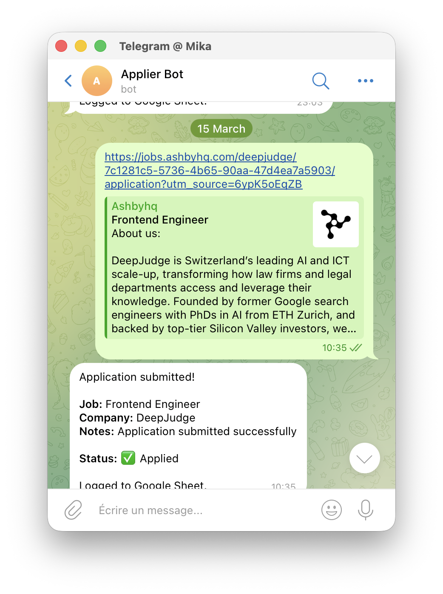

# Job Applier Bot

**Automate your job applications with AI.** Send a job URL via Telegram → AI agent fills the form, uploads your resume, submits it, and logs everything to Google Sheets. You don't touch a single form field.

Perfect for job seekers who want to apply to multiple positions without the repetitive work of filling out the same information over and over.

## How it works

```
1. You send a job URL to your Telegram bot
   ↓
2. The bot launches a browser-use agent that:
   • Opens the job posting in a real Chromium browser
   • Reads the job description
   • Finds the application form on the page
   • Fills all fields using your profile data
   • Uploads your resume PDF
   • Clicks submit
   ↓
3. The agent logs the result to your Google Sheet:
   • Company name, job title, status (Applied/Failed)
   • Job posting link, application date
   • Notes (success message or failure reason)
   ↓
4. The bot replies to you in Telegram with:
   • ✅ Application submitted! (with job details)
   • OR ❌ Application failed (with reason)
```

**You don't need to fill any forms manually** — the agent does everything from reading the job description to clicking submit, then logs the outcome to your Google Sheet automatically.

**Stack:** [browser-use](https://github.com/browser-use/browser-use) · python-telegram-bot · gspread · Docker

---

## Supported LLM providers

The bot supports multiple LLM providers via the `LLM_MODEL` variable (format: `<provider>/<model-name>`):

| Provider | Example Model | Required API Key |
|----------|---------------|------------------|
| Anthropic | `anthropic/claude-sonnet-4-6` | `ANTHROPIC_API_KEY` |
| OpenAI | `openai/gpt-4o` | `OPENAI_API_KEY` |
| Google Gemini | `gemini/gemini-2.0-flash` | `GEMINI_API_KEY` |
| Perplexity | `perplexity/sonar-pro` | `PERPLEXITY_API_KEY` |
| OpenRouter | `openrouter/google/gemini-2.0-flash-exp` | `OPENROUTER_API_KEY` |
| Ollama Cloud | `ollamacloud/llama3.3:70b` | `OLLAMACLOUD_API_KEY` |
| MiniMax | `minimax/MiniMax-M2.5` | `MINIMAX_API_KEY` |
| OpenCode Zen | `opencode/claude-sonnet-4-5` | `OPENCODE_API_KEY` |
| Together AI | `together/moonshotai/Kimi-K2.5` | `TOGETHER_API_KEY` |
| Ollama (local) | `ollama/llama3` | (none) |

You can also set a fallback model with `FALLBACK_LLM_MODEL` — used when the primary model returns invalid output.

---

## Prerequisites

### System Requirements

- **VPS or Local Machine:**
  - 2 GB RAM minimum (4 GB recommended for larger forms)
  - 2 CPU cores
  - 5 GB disk space (for Docker images and Chromium)
- **Docker and Docker Compose** installed
- **SSH access** to your server (if deploying remotely)

### Required Accounts & Services

- **LLM Provider:** API key from one of the supported providers (see table above)
  - Recommended: Anthropic Claude or OpenAI GPT-4
  - Free option: Local Ollama (see setup below)
- **Telegram Bot:** Create via [@BotFather](https://t.me/BotFather)
- **Google Cloud:** Service account with Sheets API access
- **Google Sheet:** Spreadsheet to log applications (can be empty to start)

---

## Setup

### 1. Clone the repo and create your `.env`

```bash
git clone https://github.com/mikaoelitiana/applier.git
cd applier
cp .env.example .env
```

Edit `.env` and fill in all required values:

- `LLM_MODEL` - Choose your LLM provider (see supported providers above)
- Corresponding API key (e.g., `ANTHROPIC_API_KEY` if using Anthropic)
- `TELEGRAM_BOT_TOKEN` - From step 3 below
- `ALLOWED_TELEGRAM_USER_IDS` - Your Telegram user ID (from step 3)
- `GOOGLE_SHEET_ID` - From step 4 below
- `GOOGLE_SERVICE_ACCOUNT_JSON` or `GOOGLE_SERVICE_ACCOUNT_FILE` - From step 4 below

### 2. Add your assets

The bot needs your resume and profile to fill application forms. You can provide them in two ways:

**Option A — Upload via Telegram (easiest)**

Once the bot is running, simply send the files directly in the chat:

- Send a **PDF file** → saved as your resume
- Send a **JSON file** → saved as your profile

**Option B — Place files manually**

Put your files in the `assets/` directory before starting the bot:

| File | Description |
|------|-------------|
| `assets/resume.pdf` | Your resume — uploaded to application forms |
| `assets/profile.json` | Your personal details used to fill forms |
| `assets/service_account.json` | Google service account key (optional — see step 4) |

To create your profile, copy the example file and fill in your information:

```bash
cp assets/profile.json.example assets/profile.json
# Edit assets/profile.json with your real information
```

> **Note:** `service_account.json` is only required if you use the file-based credential option (Option B in step 4). If you set `GOOGLE_SERVICE_ACCOUNT_JSON` in `.env`, you don't need this file at all.

### 3. Create a Telegram bot

1. Open Telegram and message [@BotFather](https://t.me/BotFather)
2. Send `/newbot` and follow the prompts
3. Copy the token it gives you into `TELEGRAM_BOT_TOKEN` in your `.env`
4. Find your own Telegram user ID by messaging [@userinfobot](https://t.me/userinfobot)
5. Add your user ID to `ALLOWED_TELEGRAM_USER_IDS` in `.env` to restrict access to yourself

### 4. Set up Google Sheets access (service account)

A service account lets the bot write to your sheet without any OAuth browser flow — ideal for a headless VPS.

**Step 1 — Create a Google Cloud project**

1. Go to [https://console.cloud.google.com](https://console.cloud.google.com)
2. Create a new project (or reuse an existing one)

**Step 2 — Enable the Google Sheets API**

1. In your project, go to **APIs & Services → Library**
2. Search for "Google Sheets API" and click **Enable**

**Step 3 — Create a service account**

1. Go to **APIs & Services → Credentials**
2. Click **Create Credentials → Service Account**
3. Give it any name (e.g. `job-applier`)
4. Skip the optional role/user steps and click **Done**

**Step 4 — Download the JSON key**

1. Click the service account you just created
2. Go to the **Keys** tab
3. Click **Add Key → Create new key → JSON**
4. The file downloads automatically to your computer

**Step 5 — Configure credentials**

You have two options for providing the key to the bot:

**Option A — Env var (recommended for VPS/CI)**

Minify the downloaded JSON to a single line and set it in `.env`:

```bash
GOOGLE_SERVICE_ACCOUNT_JSON={"type":"service_account","project_id":"..."}
```

A quick way to minify it:
```bash
cat ~/Downloads/your-key-file.json | python3 -m json.tool --compact
```

**Option B — File mount**

Save the downloaded file as `assets/service_account.json`. Leave `GOOGLE_SERVICE_ACCOUNT_JSON` unset and the bot will fall back to reading the file via `GOOGLE_SERVICE_ACCOUNT_FILE` (defaults to `assets/service_account.json`).

**Step 6 — Share your Google Sheet with the service account**

1. Open your Google Sheet
2. Click **Share**
3. Add the service account's email address (visible in the Credentials page — it looks like `job-applier@your-project.iam.gserviceaccount.com`)
4. Give it **Editor** access
5. Click **Send**

**Step 7 — Copy the Sheet ID**

From your sheet's URL:
```
https://docs.google.com/spreadsheets/d/THIS_IS_THE_SHEET_ID/edit
```
Paste this value into `GOOGLE_SHEET_ID` in your `.env`.

**Step 8 — Understand what gets logged to your sheet**

Each application creates a new row in your Google Sheet with these columns:

| Column | Example Value | Description |
|--------|--------------|-------------|
| **Company** | DeepJudge | Extracted from job posting |
| **Title** | Frontend Engineer | Job title from posting |
| **Status** | ✅ Applied | Applied (success) or Failed (with reason) |
| **Job Posting Link** | https://jobs.ashbyhq.com/... | Original URL you sent |
| **Contact** | hr@company.com | If found on the page |
| **Application Date** | 2026-03-15 | When the application was submitted |
| **Interview Stage** | - | (Empty initially, update manually later) |
| **Interviewer** | - | (Empty initially, update manually later) |
| **Notes** | Application submitted successfully | Success message or failure reason |

The bot will **automatically create these columns** if your sheet is empty. The default tab name is `Applications` (configure via `GOOGLE_SHEET_TAB` in `.env`).

---

## Deployment

### Run with Docker Compose (recommended)

```bash
# Build and start
docker compose up -d

# View logs
docker compose logs -f

# Stop
docker compose down
```

Assets are stored in a named Docker volume (`applier_assets`) that persists across deployments and container restarts. You need to populate it once after the first deployment.

### Uploading assets to the volume

**Recommended — send files via Telegram**

Once the container is running, send your files directly to the bot in Telegram:

- Send a **PDF file** → saved as your resume
- Send a **JSON file** → saved as your profile

The bot confirms each upload and the files are stored in the persistent `applier_assets` volume immediately.

**Alternative — copy files with docker cp**

If you prefer to copy files from outside the container:

```bash
# Upload from your local machine to the VPS first
scp assets/resume.pdf assets/profile.json user@your-vps-ip:/tmp/

# Find the container name
docker compose ps

# Then copy from the VPS into the running container
# Replace 'applier-applier-1' with your actual container name from the command above
docker cp /tmp/resume.pdf applier-applier-1:/app/assets/resume.pdf
docker cp /tmp/profile.json applier-applier-1:/app/assets/profile.json
```

The container must be running before `docker cp` will work (the volume is created on first start).

If you set `GOOGLE_SERVICE_ACCOUNT_JSON` as an env var, you don't need to copy `service_account.json`.

Files survive redeployments — repeat whichever method you prefer whenever you want to update your resume or profile.

### Run locally (without Docker)

```bash
python -m venv .venv
source .venv/bin/activate
pip install -r requirements.txt
playwright install chromium
playwright install-deps chromium

cp .env.example .env
# Edit .env, then:
python -m src.bot
```

---

## Usage

### Upload your resume and profile

Send files directly to the bot to update your assets at any time:

- Send a **PDF** → replaces your resume (`assets/resume.pdf`)
- Send a **JSON** → replaces your profile (`assets/profile.json`)

The bot validates the JSON before saving and confirms each upload.

### Apply to a job

**Simply send a job posting URL to your Telegram bot** — no commands needed, just paste the URL.

**Supported job boards:**
```
LinkedIn:    https://www.linkedin.com/jobs/view/123456789/
Lever:       https://jobs.lever.co/company/job-id
Workable:    https://apply.workable.com/company/j/job-code/
Greenhouse:  https://greenhouse.io/company/jobs/123456
Ashby:       https://jobs.ashbyhq.com/company/job-id
Bamboo HR:   https://company.bamboohr.com/jobs/view.php?id=123
```

**What happens next:**

1. **Agent launches** — Opens the job page in a real browser
2. **Reads the job** — Extracts company name, job title, description
3. **Finds the form** — Locates input fields (name, email, phone, etc.)
4. **Fills everything** — Uses your `profile.json` data to complete the form
5. **Uploads resume** — Attaches your `resume.pdf` to upload fields
6. **Submits** — Clicks the submit button
7. **Updates Google Sheet** — Logs the application with all details
8. **Replies to you** — Confirms success or explains failure

**Example:**



**Success response:**
```
✅ Application submitted!

Job: Frontend Engineer
Company: DeepJudge
Notes: Application submitted successfully

Status: ✅ Applied

Logged to Google Sheet.
```

**Failure response:**
```
❌ Application failed.

Job: Senior Software Engineer
Company: Example Corp
Reason: Form requires login — no public application available.

Logged to Google Sheet (marked as failed).
```
https://www.linkedin.com/jobs/view/123456789/
https://jobs.lever.co/company/job-id
https://apply.workable.com/company/j/job-code/
https://greenhouse.io/company/jobs/123456
https://jobs.ashbyhq.com/company/job-id
```

Just paste the URL — no commands needed. The bot will:
1. Open the page in a browser
2. Read the job description
3. Find and fill the application form
4. Upload your resume
5. Submit the application
6. Log the result to your Google Sheet

**Success response:**
```
✅ Application submitted!

Job: Senior Software Engineer
Company: Example Corp

Logged to Google Sheet.
```

**Failure response:**
```
❌ Application failed.

Job: Senior Software Engineer
Company: Example Corp
Reason: Form requires login — no public application available.

Logged to Google Sheet (marked as failed).
```

---

## Project structure

```
applier/
├── Dockerfile
├── docker-compose.yml
├── requirements.txt
├── .env.example
├── assets/
│   ├── profile.json.example  ← template for your personal details
│   ├── profile.json          ← your personal details (add this yourself)
│   ├── resume.pdf            ← your resume (add this yourself)
│   └── service_account.json  ← Google service account key (add this yourself)
└── src/
    ├── bot.py      ← Telegram bot entrypoint
    ├── agent.py    ← browser-use agent + task definition
    ├── sheets.py   ← Google Sheets writer
    └── config.py   ← settings loaded from .env
```

---

## Troubleshooting

### Bot not responding to messages

**Check if the bot is running:**
```bash
docker compose ps
docker compose logs -f
```

**Common causes:**
- `TELEGRAM_BOT_TOKEN` is incorrect or missing
- Your user ID is not in `ALLOWED_TELEGRAM_USER_IDS`
- Container failed to start (check logs)

### Application failures

**Check the error message** — the bot will explain why it failed:
- "Form requires login" → No public application form available
- "Timeout" → Job posting page took too long to load (try again or increase `JOB_TIMEOUT_MINUTES`)
- "Could not find application form" → The page structure isn't recognized

**View detailed logs:**
```bash
# View container logs
docker compose logs -f

# Or check the log file (inside the container)
docker compose exec applier-applier-1 tail -f /app/assets/applier.log
```

### Google Sheets not updating

**Verify service account setup:**
1. Check that the service account email is shared with your Google Sheet (with Editor access)
2. Verify `GOOGLE_SHEET_ID` matches your sheet's URL
3. Ensure `GOOGLE_SHEET_TAB` matches your tab name (default: `Applications`)

**Test credentials:**
```bash
# Check if the credentials are loaded correctly
docker compose logs | grep -i "google\|sheet\|gspread"
```

### LLM errors or "Invalid agent output"

**If using a fallback model:**
- The bot will automatically retry with `FALLBACK_LLM_MODEL` if the primary model fails
- Check logs to see which model is being used

**API key issues:**
- Verify your API key is correct and active
- Check that you have credits/quota remaining
- Ensure the model name matches the provider's supported models

### Container keeps restarting

**Check resource limits:**
```bash
docker stats
```

Chromium needs at least 2 GB RAM. If you're running low on memory, try:
- Using a lighter LLM model
- Increasing your server's RAM
- Closing other applications

### Local Ollama setup

If using `ollama/llama3` without an API key:

1. **Install Ollama locally:**
   ```bash
   # macOS
   brew install ollama
   
   # Linux
   curl -fsSL https://ollama.com/install.sh | sh
   ```

2. **Pull a model:**
   ```bash
   ollama pull llama3.1:8b
   ```

3. **Run Ollama server:**
   ```bash
   ollama serve
   ```

4. **Configure the bot:**
   ```bash
   # In .env
   LLM_MODEL=ollama/llama3.1:8b
   ```

**Note:** If running the bot in Docker and Ollama on your host machine, use `host.docker.internal` instead of `localhost` in the Ollama URL.

---

## FAQ

**Q: How much does it cost to run?**
- VPS: $5-10/month (e.g., DigitalOcean, Hetzner, AWS Lightsail)
- LLM API: Varies by provider
  - Anthropic Claude: ~$0.10-0.50 per application
  - OpenAI GPT-4: ~$0.05-0.30 per application
  - Local Ollama: Free (but requires more RAM)

**Q: How many applications can I submit per hour?**
- No hard limit, but be respectful to job boards
- Each application takes 1-5 minutes depending on form complexity
- Consider rate limiting to avoid triggering anti-bot measures

**Q: Can I use this for multiple job seekers?**
- Yes, but you'll need separate Telegram bots and Google Sheets for each person
- Set up multiple deployments with different `.env` configurations

**Q: What job boards are supported?**
- The bot works with most modern job application forms
- Confirmed working: LinkedIn, Lever, Greenhouse, Workable, Ashby, Bamboo HR
- Does NOT work with: Forms requiring login, CAPTCHA-protected sites, multi-step applications across different domains

**Q: Will this get me banned from job boards?**
- Unlikely if used responsibly
- The bot uses a real browser (Chromium) and mimics human behavior
- Avoid submitting dozens of applications per minute
- Each application is genuinely filled out, not spam

**Q: Can I customize the cover letter per job?**
- Yes! Edit the `cover_letter_intro` field in your `profile.json`
- The agent uses your profile data and the job description to fill forms appropriately

**Q: How do I update my resume or profile?**
- Send new files to the Telegram bot (easiest)
- Or use `docker cp` to copy updated files into the container
- Changes take effect immediately for the next application

---

## Debugging

### View logs

**Real-time logs:**
```bash
docker compose logs -f
```

**Application logs (inside container):**
```bash
docker compose exec applier-applier-1 cat /app/assets/applier.log
```

**Filter for errors:**
```bash
docker compose logs | grep -i error
```

### Check environment variables

```bash
docker compose exec applier-applier-1 env | grep -E "LLM_MODEL|TELEGRAM|GOOGLE"
```

### Test the bot manually

Send `/start` to your Telegram bot to verify it's responding.

### Restart the bot

```bash
docker compose restart
docker compose logs -f
```

---

## Security notes

- `assets/resume.pdf` contains personal data — never commit it to git
- `assets/profile.json` contains personal data — never commit it to git (use `profile.json.example` as a template)
- `assets/service_account.json` contains sensitive credentials — never commit it to git (prefer the `GOOGLE_SERVICE_ACCOUNT_JSON` env var on a VPS so no file needs to be transferred)
- Use `ALLOWED_TELEGRAM_USER_IDS` to restrict bot access to your own account
- Keep your `.env` file out of version control (it is in `.gitignore`)

---

## License

MIT License - feel free to use this for personal or commercial purposes.

See [LICENSE](LICENSE) for details.
